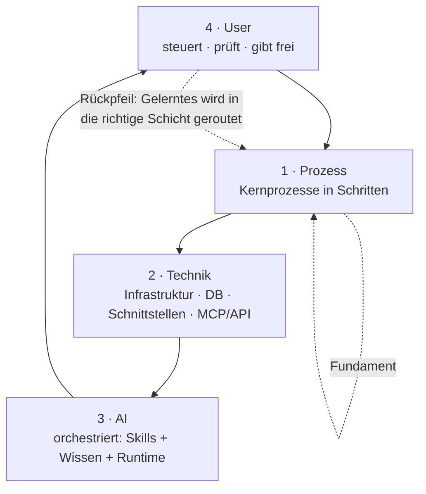

# KI-Betriebssystem — Blueprint

> High-Level-Standard *und* Foliensatz-Vorlage in einem. Jeder H2-Abschnitt ≈ eine Folie.
> Erprobt am Betrieb GRÜNSCHNITT (Garten- und Landschaftsbau).
> Löst die alte 3-Ebenen-Fassung ab (Foliensatz-Anleitung, bewusst nicht migriert).
> Detailwissen liegt in eigenen Notizen — siehe Landkarte am Ende.

---

## Zielbild: Vier Schichten, ein Kreislauf

Ein AI Operating System entsteht **erst durch das Ineinandergreifen** von vier Schichten. Jede Schicht ist **Voraussetzung** für die darüber — und der Mensch schließt den Kreis zur Selbstoptimierung.

- **Nach oben = Abhängigkeit:** ohne Prozess + Ziele und ohne digitale Infrastruktur nützt die KI nichts.
- **Rückpfeil = Selbstoptimierung:** = der [[Wissenskreislauf KI-Betriebssystem]] (Erfassen → Destillieren → Befördern → Versionieren).

## Die Kern-These

- **Technik ↔ Prozess müssen explizit verknüpft sein.** Der Betrieb braucht klare Kernprozesse, und die müssen technisch beschrieben sein — sonst ist beides wertlos.
- **Die AI ist das Koppel-Zahnrad:** sie liest nach unten den Prozess und bedient die Technik. Ohne Business dreht sie ins Leere, ohne Technik greift sie in nichts.
- **Prinzip:** Ich lege AI nicht über meine Prozesse — ich denke die Prozesse neu (nicht den kaputten Prozess digitalisieren).

## Schicht 1 — Prozess (Fundament)

- Kernprozesse **kennen, dokumentieren, in Schritte zerlegen.** Je Schritt: **Input → Verarbeitung → Output** (SIPOC-Denken).
- Standardisiert und regelbasiert → die KI arbeitet zuverlässig, weil Ziele und Anweisungen klar und messbar sind.
- **Anker-Regel:** Soll-Prozess führt. Werkzeug-Vokabular (z. B. Statusnamen) nur übernehmen, wo es den Soll-Prozess sauber spiegelt.
  - **Standardprozess** (z. B. Bau): Tool bildet ihn meist ab → andocken, gemeinsame Sprache mitnehmen.
  - **Individualprozess** (projekt-ohne-angebot, abo): selbst modellieren.
- Detail: [[Prozesslandkarte]] · [[Prozess Bauprojekt End-to-End]]

## Schicht 2 — Technik

- Die **gesamte** digitale Infrastruktur, die von der KI bedient wird: Architektur, Datenbank, **Schnittstellen & Kommunikation**, MCP/API, Konnektoren/Tools.
- **Fundament jeder Anbindung:** eine vollständige, maschinenlesbare Selbstbeschreibung des Zielsystems (Introspection / Schema).
- **Tiefe der Tool-Schicht — gestuft nach Fehlerkosten:**
  - Standard = **dünn** anbinden (rohe API / generischer MCP + Regeln im Skill + verifizierte Doku).
  - **Dick** (eigener deterministischer Code) nur, wo ein KI-Fehler teuer ist *oder* die Software die Logik nicht selbst garantiert.
- **Determinismus lebt — in dieser Reihenfolge:** 1. Zielsoftware · 2. eigener Code · 3. **nie** im LLM.
- Detail: [[Hero]] · `vault/02 Technik/Hero/Praxiswissen (verifiziert)/`

## Schicht 3 — AI

- **Orchestriert:** Skills (Prozesswissen) + Wissen (Gedächtnis) + Runtime (Claude Code).
- **Kontext-Engineering:** die KI weiß je Aufgabe, welchen Kontext sie braucht — und lädt nur den.
- **Progressive Disclosure:** nur der aktuell anstehende Schritt wird geladen → Kontext bleibt schlank.
- **Skill = Prozess:** 1 Skill spiegelt 1 Prozess, Schritt-Dateien je Phase; Skills referenzieren Beispiele/Wissen im Vault.
- Skills: `.claude/skills/` (bauprojekt · projekt-ohne-angebot · abo · hero-stammdaten)

## Schicht 4 — User & das Gate

- Der Mensch **steuert, prüft, gibt frei, versendet** — und erzeugt dadurch das Lernsignal.
- **Zwei unabhängige Regler:**
  - **Gate** (wer gibt Außenwirksames frei): **risiko-gestuft und dauerhaft.** Außenwirksames/Bindendes (Kundenmail, Rechnung, Zahlung, Löschung) = **immer Mensch, für immer.** Lesen / interne Entwürfe / To-dos / Logbuch = autonom.
  - **Initiative** (wer startet): **wächst über die Zeit** — von „du befiehlst" zu „System startet gelernte Routinen".
- **Falle:** „System hat's gelernt, macht's jetzt allein" darf das Gate **nicht** aushebeln. Autonom *gestartet* ≠ ungeprüft *versendet*.

## Betriebsregel: n8n führt aus, Claude beaufsichtigt

- **Schnitt nach Art der Arbeit, nicht nach Vorliebe:**
  - **n8n** = deterministische, event-getriggerte Pipeline (optional ein KI-Klassifizier-Schritt). Läuft unbeaufsichtigt stabil. Beispiel: DATEV-Belegfluss — **bleibt in n8n.**
  - **Claude/MCP** = agentische Arbeit (Kontext, Orchestrierung, Entwürfe, Urteil).
- **Claude wird das Cockpit über n8n:** liest Executions (Status/Daten), meldet Fehlläufe, kann nachtriggern → schließt die Monitoring-Lücke. (Voraussetzung: n8n Public API + Key.)
- **Auslöser:** Zeitroutinen via Claude `/loop` / `schedule`; echte Echtzeit-Events via n8n-Webhook / Push-MCP.

## Betriebsregel: Kommunikation — reaktiv vor proaktiv

- Kommunikation (Mail, WhatsApp, Kalender) gehört zur **Technik-Schicht**.
- **Phase 1 — reaktiv:** lesbare Quelle im Entwurf-first-Ablauf (fast null Risiko, nutzt Vorhandenes).
- **Phase 2 — proaktiv:** Ereignis-Trigger antizipieren Aufgaben — **jeder Vorschlag landet als Entwurf in einer Review-Liste, nie automatisch versendet.**
- **Strato-Mail:** kein Spezial-MCP nötig — generischer **IMAP/SMTP-MCP**, der **Entwürfe im Drafts-Ordner** ablegen kann (nicht nur senden).

## Der Rhythmus: Explore → Plan → Execute → Review

Ein **fraktaler** 4-Takt — derselbe Rhythmus auf zwei Höhen:

| Takt | Laufzeit (OS arbeitet) | Build (OS erweitern) |
|------|------------------------|----------------------|
| **Explore** | Kontext-Auflösung (Kunde → Projekt → Status) | Prozess + Zielsystem verstehen |
| **Plan** | Entwurf im Chat | modellieren („erst modellieren, dann bauen") |
| **Execute** | gated Schreibzugriff über Tools | Skill/Tool bauen |
| **Review** | Mensch gibt frei + System lernt | testen + dokumentieren |

> Muster übernehmen, nicht die Dev-Annahmen (Execute ≠ „Code + Tests", sondern gated Business-Schreibzugriff).

## Governance: Zwei Repos, eine Grenze

- **Trenne genau an der Eigentums-/Übergabegrenze — nicht feiner.**
- **Repo 1 — Julian (privat):** zweites Gehirn *inkl.* Blueprint, Methode und aller Projekte. Bleibt bei mir.
- **Repo 2 — GRÜNSCHNITT-OS:** Skills, Tools, Prozessmodelle, Praxiswissen, Wissensbasen, Lernlog. **Übergabefähig** — saubere Ordner *und* saubere Git-Historie.
- Grenzfall bewusst zuordnen: der **GRÜNSCHNITT-Schreibstil** für Kundenmails gehört in Repo 2, nicht der persönliche.

## Reboot & Migration

- **Gerüst neu, Inhalt migrieren.** Frisches Repo nach diesem Blueprint (saubere Struktur + Historie) — aber verifizierte Assets **kuratiert rüberziehen, nicht neu ableiten.**
- **Warnung Second-System-Effekt:** nicht über-konstruieren, hart erarbeitetes Praxiswissen nicht wegwerfen.
- Migrations-Filter = die 1↔2-Grenze: nur OS-Wissen wandert nach Repo 2.

## Erfahrungswerte (Stand: Testfälle, noch nicht Tagesbetrieb)

- **Game-Changer: GraphQL-Introspection.** Eine vollständige technische Selbstbeschreibung des Zielsystems als Fundament — erste Frage bei jeder neuen Anbindung.
- **Technik + Prozess müssen verzahnt sein.** Klare Kernprozesse *und* ihre technische Beschreibung — eines ohne das andere trägt nicht.
- **Test ≠ Praxis.** Das Blueprint ist heute *test-validiert*, nicht *felderprobt*. Ehrlich so benennen.
- **Determinismus nie ins LLM.** Kritische Logik gehört in Zielsoftware oder Code.
- **Reads erkunden, Writes gaten.** Ausprobieren-bis-es-klappt ist sicher beim Lesen, gefährlich beim Schreiben (Datenmüll).
- **Selbstoptimierung braucht ein Gate.** Nichts wird automatisch zur Regel — sonst lernt das System aus Einmal-Ausnahmen falsche Gesetze.

## Landkarte: Wo finde ich das Detailwissen

| Thema | Notiz |
|-------|-------|
| Wie das System lernt | [[Wissenskreislauf KI-Betriebssystem]] |
| Prozessmodelle | [[Prozesslandkarte]] · [[Prozess Bauprojekt End-to-End]] |
| Beobachtungsspeicher | [[Lernlog Bauprozess]] |
| Technisches Praxiswissen | [[Hero]] · `02 Technik/Hero/Praxiswissen (verifiziert)/` |
| Prozess-Skills | `.claude/skills/` (bauprojekt · projekt-ohne-angebot · abo · hero-stammdaten) |
