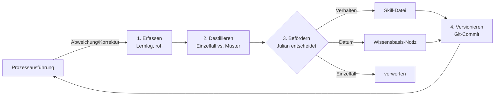

# Wissenskreislauf des KI-Betriebssystems

Wie das System aus der laufenden Prozessausführung lernt — vom Rohlog bis zum
Wissen, das künftige Ausführungen besser macht. Gilt zunächst für den
[[Prozess Bauprojekt End-to-End]], das Muster ist aber für alle Prozesse gleich.

## 1. Die drei Ebenen (Architektur)

| Ebene | Was | Wo | Ändert sich |
|-------|-----|----|-------------|
| 1 — Fähigkeiten | Atomare Tools (CLI, 1 Befehl = 1 Operation), deterministische Logik in Code | `tools/hero-tools/` (dieses Repo) | selten, durch Entwicklung |
| 2 — Prozesse | Skills: Anweisungen je Kernprozess, Schritt-Dateien je Phase | `.claude/skills/` in diesem Repo | selten, nur durch bewusste Beförderung |
| 3 — Wissen | Prozessnotizen, Praxiswissen, Wissensbasen, Lernlog | Vault (`vault/00 Betrieb/` bis `04 User/`) | laufend |

Claude Code ist die Runtime: Ein Anliegen triggert den passenden Skill
(Ebene 2), der ruft Tools (Ebene 1) und liest Wissen (Ebene 3).

## 2. Die drei Wissensarten — und ihr Speicherort

Die zentrale Architekturentscheidung: **Wo Wissen landet, hängt von seiner Art
ab**, nicht davon, wo es entstanden ist.

| Art | Beispiel | Speicherort | Wie es in die Ausführung kommt |
|-----|----------|-------------|-------------------------------|
| **Verhaltensregel** (stabil, bestätigt) | "Bei Hanglage immer Hangsicherung anbieten", "Summen auf glatte Beträge runden" | Skill bzw. Schritt-Datei | lädt **automatisch** bei jedem Trigger des Skills |
| **Datum/Fakt** (ändert sich laufend) | Preisspannen je Projekttyp, typische Positionen, Kundenpräferenzen, Stammlieferanten | Vault-Wissensbasis-Notiz | Skill enthält **Pfad + Leseanweisung**; gelesen zur Laufzeit im passenden Schritt (Progressive Disclosure) |
| **Rohbeobachtung** (unbestätigt) | "Marvin hat EP von 50 auf 55 € geändert und Anfahrtspauschale ergänzt" | [[Lernlog Bauprozess]] (append-only) | gar nicht — Rohlog fließt **nie** direkt in die Ausführung |

Warum die Trennung: Der Skill-Text wird bei jedem Trigger komplett geladen —
er muss schlank bleiben und soll sich selten ändern. Daten dagegen wachsen,
ändern sich oft und werden nur in einzelnen Schritten gebraucht.
**Regeln immer im Kontext, Daten auf Abruf.**

## 3. Der Kreislauf (4 Schritte)

### Schritt 1: Erfassen (Agent, laufend, automatisch)

Immer wenn die Ausführung von der Vorbereitung abweicht, schreibt der Agent
einen Rohlog-Eintrag ins [[Lernlog Bauprozess]] (Format steht dort). Quellen:

- **Chat-Korrekturen:** Julian/Marvin korrigiert Preis, Position, Ablauf
- **Entwurf-Diff:** Unterschied zwischen dem vom Agenten erzeugten
  Dokument-Entwurf und der Fassung, die Marvin final versendet hat
  (auslesbar aus dem JSON-Tresor `published_customer_document_draft.data`) —
  das ist Marvins Kopf-Wissen, messbar gemacht
- **Fehlende Grundlagen:** Katalogposition fehlt, Erfahrungswert fehlt

Regel im Skill (bauprojekt, harte Regel 8): nur beobachten, nie selbst
Regeln ableiten.

### Schritt 2: Destillieren (Agent, periodisch)

Wöchentlich oder auf Zuruf: Rohe Einträge gruppieren, Einzelfall von Muster
trennen (Faustregel: ab 2–3 gleichartigen Vorkommen ist es ein Muster).
Je Muster ein Vorschlag: Verhalten → Skill, Datum → Wissensbasis, oder
verwerfen.

### Schritt 3: Befördern (Julian, immer)

Julian ist das Gate zwischen Beobachtung und Regel. Er entscheidet je
Vorschlag; der Agent trägt ein und markiert die Log-Einträge als
`verarbeitet → <wohin>` bzw. `verworfen`. **Nichts wird automatisch zur
Regel** — sonst lernt das System aus Einmal-Ausnahmen falsche Gesetze.

### Schritt 4: Versionieren (Git, nebenbei)

Jede Beförderung ist ein Commit im Vault-Repo: nachvollziehbar, wann das
System was gelernt hat; zurückrollbar; auf allen Geräten synchron.

## 4. Beispiele durchgespielt

**Beispiel Datum:** Lernlog zeigt, dass Marvin bei 3 Terrassenprojekten
nachträglich eine Anfahrtspauschale ergänzt hat → Destillation erkennt das
Muster → Julian befördert → Eintrag "typische Position: Anfahrtspauschale"
in der Projekttypen-Wissensbasis, Zeile Terrassenbau → beim nächsten
Terrassen-Angebot schlägt der Cross-Selling-Check in B3 die Pauschale von
selbst vor.

**Beispiel Verhalten:** Marvin rundet Angebotssummen immer auf glatte
Beträge → Julian befördert → Regel in `bauprojekt/schritte/b3-angebot.md`
(Phase 1) → gilt ab sofort für jedes Angebot, ohne dass jemand daran denkt.

**Beispiel verworfen:** Einmalig 20 % Rabatt für einen Nachbarn → bleibt
Einzelfall im Log, wird nicht befördert.

## 5. Rollen im Überblick

| Rolle | Aufgabe |
|-------|---------|
| Agent (Claude Code) | erfasst Beobachtungen, destilliert Muster, macht Vorschläge, trägt Beschlossenes ein |
| Julian | entscheidet über jede Beförderung, pflegt die Prozessmodelle |
| Marvin | erzeugt durch seine Arbeit (Korrekturen, finale Dokumente) das Lernsignal — ohne Zusatzaufwand |
| Git | Audit-Trail und Synchronisation |

## Verwandte Notizen

- [[Prozesslandkarte]] und [[Prozess Bauprojekt End-to-End]] — die Prozessmodelle
- [[Lernlog Bauprozess]] — der Beobachtungsspeicher
- [[Hero]] — technisches Praxiswissen (entsteht nach demselben Prinzip: verifizieren, dann dokumentieren)
